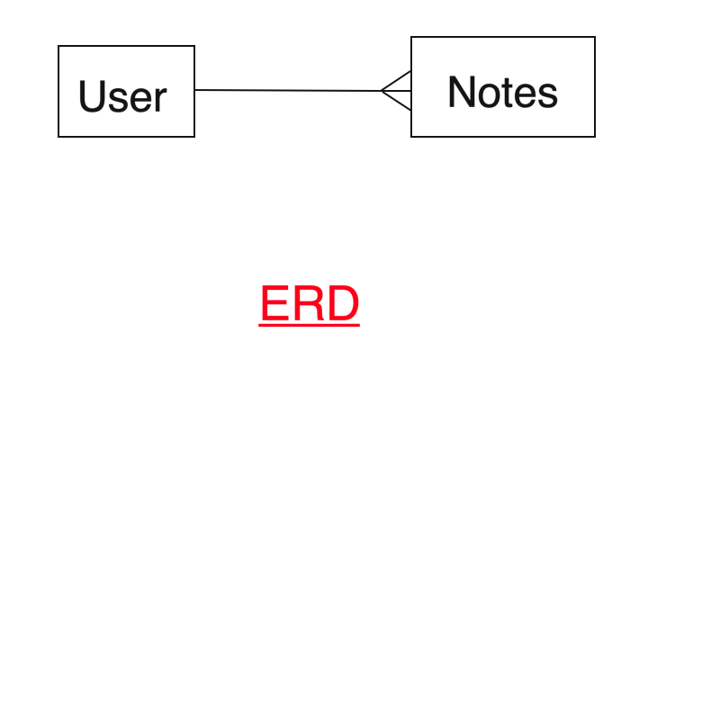
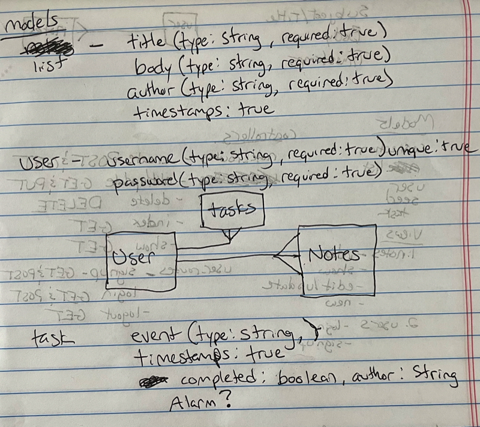
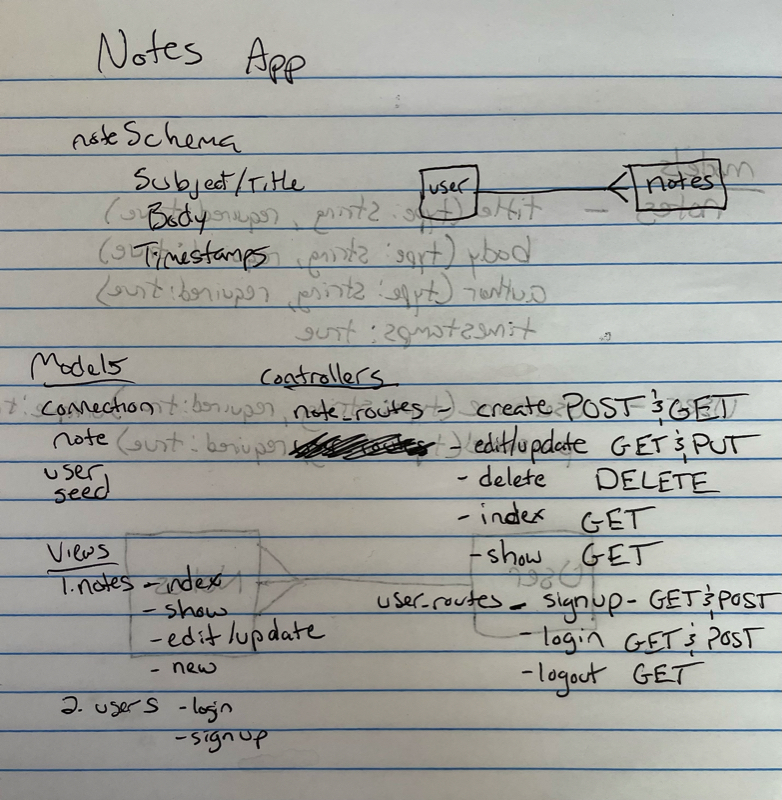
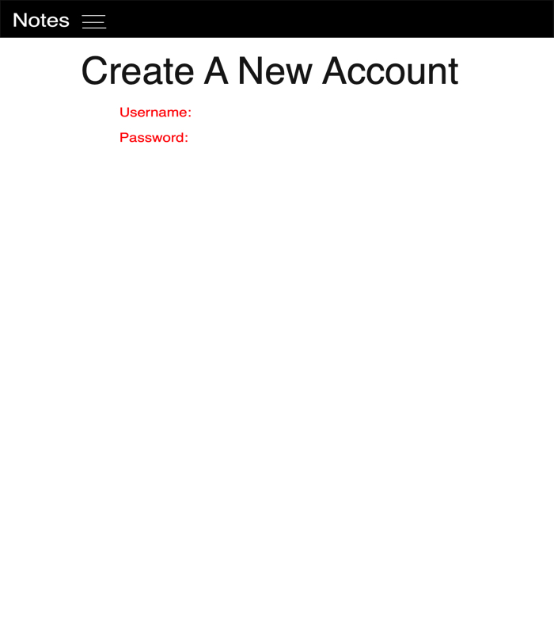
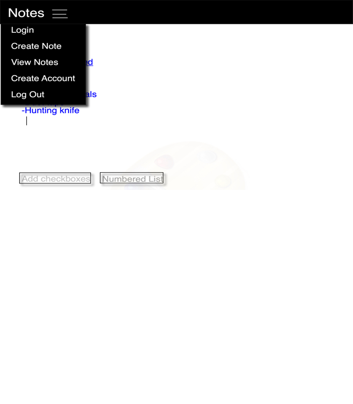
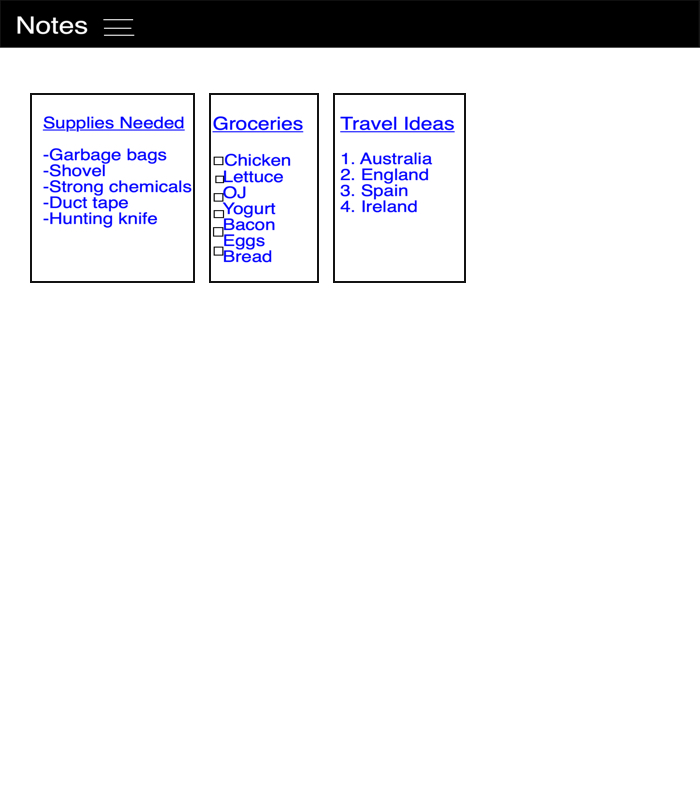
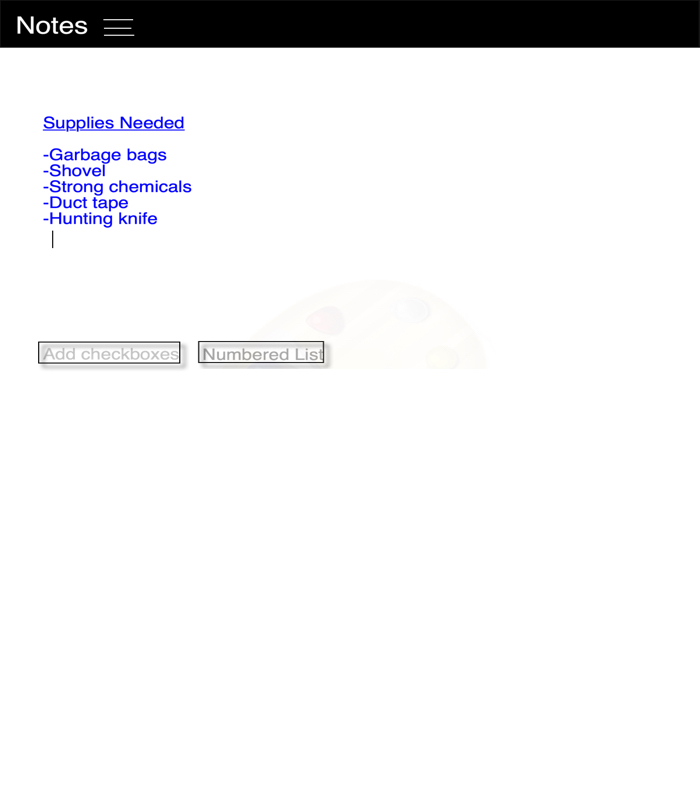

# project2app
Project 2 App
a reminder of what is needed in your planning docs (aka in your README):
complete ERDs for both models AND user model (3 models in total)
at least 15 user stories
at least 8 wireframes
a list of APIs or NPM packages or an overview of the seeded data (which requires 10 documents)
NOTE: seeded data does not have to be completely built out in the planning stages, just some indication of an idea of what will be seeded.
a routes table demonstrating the full CRUD actions for at least one resource

////////////// Using ///////////////
- Google Keep API
- Bootstrap
- mongoose
- connect-mongo
- dotenv
- express
- express-sesson
- liquidjs
- liquid-express-views
- method-override
- bcryptjs
- node-fetch
- morgan

////////////// User Stories ///////////////

As a user I would like to:

- On main page
    - view all notes
        - search notes by querying for specific string
        - be able to click on individual notes to view, edit or delete
    - have navbar with drop down menu
        - create account
            - require that username is unique
            - require password
            - return user to index page to start creating notes
        - log in
            - query for single username
            - query for single password
            - return user to index page with all notes
        - log out
        - create new note
            - use checkboxes or numbered list ??
        - back to index of all notes

- On show page
    - view individual note
    - view what time the note was created
    - view if the note was edited and if so the time
    - edit that note
    - delete that note
    - favorites/star button ?? (similar to ripe on fruits crud?)
    - reminders/alarm that goes off at specified time

